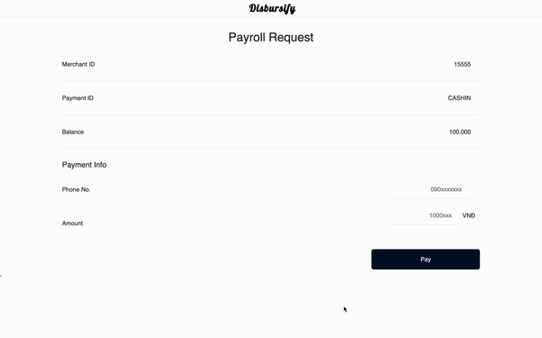

# Quick Start: Disbursement

- [Quick Start: Disbursement](#quick-start-disbursement)
  - [Overview](#overview)
  - [Requirements](#requirements)
  - [Installation](#installation)
  - [Usage](#usage)
  - [Notice](#notice)
  
## Overview

Disbursement refers to the act of paying out money, typically from a fund or account. ZaloPay offers disbursement feature that enables merchant transfer money to user. For example, the earned money from a campaign can be rewarded to participants, or company payout the employee's salary, etc . . .

This repository includes examples of integrations for online payments with ZaloPay [Disbursement APIs](https://docs.zalopay.vn/en/v2/payments/disbursement/overview.html). Within this Disbursify demo app, you'll find a simplified version of payroll application, complete with commented code to highlight key features and concepts of Disbursement's APIs.

<p align="center">
  
</p>

## Requirements

Node.js 12+

## Installation

1. Clone this repo:

```
git clone https://github.com/zalopay-samples/quickstart-node-disbursement.git
```

2. Navigate to the root directory and install dependencies:

```
npm install
```

## Usage

1. For quickstart, we provide pre-created account that without having to register a new merchant account, all configuration keys are placed in the `./.env` file. If you have other keys, please change them as follows

```
REACT_APP_APP_ID="your_APP_ID_here"
REACT_APP_PAYMENT_ID="your_PAYMENT_ID_here"
REACT_APP_KEY1="your_KEY1_here"
REACT_APP_PRIVATE_KEY="your_PRIVATE_KEY_here"
```

If you want a mock server, set `REACT_APP_IS_MOCK=1`

1. Start the backend

```
npm run backend
```

1. Start the frontend

```
npm run frontend
```

Visit [http://localhost:3000/](http://localhost:3000/) to make a payroll request that pay via ZaloPay using Disbursement APIs.

To try out payment you need install and register ZaloPay Sanbox , see [Test App](https://zalopay-samples.github.io/test-wallets).

## Notice

This project was bootstrapped with [Create React App](https://github.com/facebook/create-react-app), using the [Redux](https://redux.js.org/) and [Redux Toolkit](https://redux-toolkit.js.org/) template.

